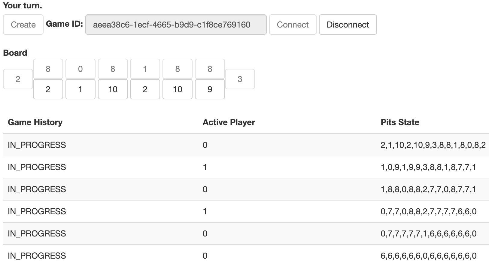

# Mancala Game

## How to Play

1. Run `docker compose up`.
2. Open [localhost:8080](http://localhost:8080) in your browser—this is the first player’s game perspective.
3. _Create_ a new game and copy game ID from an input field.
4. Open [localhost:8080](http://localhost:8080) in another browser tab—this is the second player’s game perspective.
5. Paste game ID in an input field and click _Connect_.
6. The game has started. Use board buttons to make turns. Switch browser tabs to switch between players.

## Reasoning Behind Technical Decisions

1. Domain objects are immutable—thus they’re thread safe and easy to reason about.
2. Game logic is presented as a set of rules, connected into a Chain of Responsibility. It allows us to keep
   the code neat and clean and to test small chunks of logic separately.
3. Redis is used to store game state as a serialized string. If at some point we need more sophisticated approach
   (e.g. to search games by their status), we may want to switch to MongoDB or even to RDB.
4. Frontend is quite primitive—it’ll be easy to switch to a prettier one because API
   is [documented with Swagger](http://localhost:8080/admin/swagger-ui/index.html).
5. In a production environment we’ll want to pay attention to API’s security. However, I decided that this topic
   is out of this assignment’s scope.
